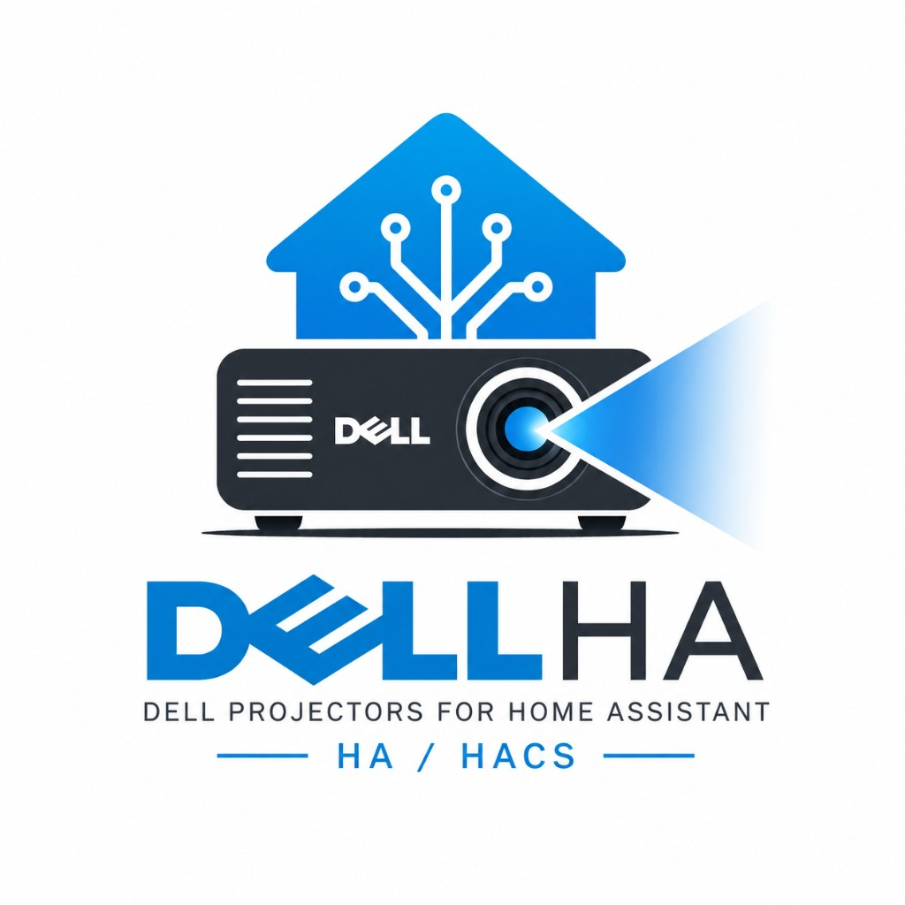

<p align="center">
  
</p>

# Dell Projector Network Interface for Home Assistant

[](https://github.com/CaelanBorowiec/ha-dell-projector-network-control/actions/workflows/validate.yml)
[](https://github.com/CaelanBorowiec/ha-dell-projector-network-control/actions/workflows/lint.yml)
[](https://github.com/hacs/integration)

A Home Assistant integration for controlling compatible Dell projectors (7609WU, 1610HD, 4210X, 4220, 4310WX, 4320, S320wi, and others) over the
network, using the projector's built-in web management page instead of an RS232
cable. Dell never documented this HTTP interface, so it was reverse-engineered
for this project. The full write-up is in [docs/PROTOCOL.md](docs/PROTOCOL.md).

This integration works with any Dell projector that uses the "Web Management" interface with the `ATOP` cookie and MD5 challenge-response login.

## Supported Projectors

Originally developed on the **Dell 7609WU**, but the underlying web management interface is shared across a wide range of Dell projectors. The following models are known or highly likely to be supported:

- Dell 1209S
- Dell 1410X
- Dell 1510X
- Dell 1610HD
- Dell 3400MP
- Dell 4210X
- Dell 4220
- Dell 4310WX
- Dell 4320
- Dell 4610X
- Dell 7609WU
- Dell 7700HD
- Dell M110
- Dell M115HD
- Dell S300w
- Dell S320
- Dell S320wi
- Dell S500
- Dell S500wi
- Dell S510

If your Dell projector has an ethernet port or wireless module and a web interface that prompts for an "Admin Password" (defaulting to `admin`), it will likely work with this integration.

## What you get

Each projector becomes a device with the following entities:

| Entity | Type | Notes |
|---|---|---|
| Power | switch | Power ON / Power OFF |
| Blank screen | switch | hide/show the image |
| ECO mode | switch | ECO vs Full Power lamp mode |
| Source | select | VGA-A/B, S-Video, Composite, Component, DisplayPort, HDMI-A/B |
| Video mode | select | Presentation, Bright, Movie, sRGB, Custom |
| Aspect ratio | select | 1:1, 4:3, 16:9 |
| Projection mode | select | front/rear, desktop/ceiling |
| Power saving timeout | select | Off to 120 min |
| Brightness / Contrast | number | 0-100 |
| Volume | number | 0-20 |
| Status | sensor | Lamp ON, Standby, Warm up, Cooling, Power Saving |
| Lamp hours | sensor | total lamp runtime |
| Error status | sensor | diagnostic |
| Firmware version | sensor | diagnostic, disabled by default |
| Auto adjust | button | trigger source auto-adjustment |

You can add as many projectors as you like, one config entry per unit. The
integration polls each projector every 30 seconds and refreshes right away
after you send a command.

If the projector has an admin password set, enter it during setup. The
username is hardcoded to `administrator` in the firmware so you only need the
password. If the password changes later, Home Assistant will prompt you to
reauthenticate.

Projectors can also show up automatically via DHCP discovery (the integration
watches for Dell MAC addresses and probes the web interface to confirm it's
actually a projector), but adding one manually by IP always works.

## Installation

### HACS (custom repository)

1. In HACS, open the menu and pick "Custom repositories".
2. Add `https://github.com/CaelanBorowiec/ha-dell-projector-network-control`
   with category "Integration".
3. Install "Dell Projector Network Interface" and restart Home Assistant.

### Manual

Copy `custom_components/dell_7609wu/` into your Home Assistant
`config/custom_components/` directory and restart.

## Setup

1. Go to Settings > Devices & Services > Add Integration and search for
   "Dell Projector Network Interface".
2. Enter the projector's IP address.
3. Enter the admin password if one is set on the projector, otherwise leave it
   blank.

Repeat for each projector.

## What's in this repo

| Path | Purpose |
|---|---|
| `custom_components/dell_7609wu/` | the Home Assistant integration |
| `docs/PROTOCOL.md` | reverse-engineered HTTP API reference for the 7609WU |
| `tools/api-tester.html` | standalone test page. Open it in a browser, point it at a projector, and fire raw commands |
| `tools/smoke_test.py` | CLI test of the API client (`python tools/smoke_test.py <ip> [--password X] [--command]`) |

## Notes and limitations

The 7609WU's web server is HTTP/1.0 from 2008. There's one session cookie
(`ATOP`), state is scraped from HTML, and commands are full form posts. The
integration replays exactly what a browser would send, so read the protocol
doc before changing any of the payload handling.

Power state comes from the firmware's own status text. After turning the
projector on or off it goes through "Warm up" or "Cooling" first, which you
can watch in the Status sensor.

The projector password is limited to 4 characters by the firmware and the
login uses unsalted MD5. Treat it as a convenience lock, not real security.

Getting into the HACS default store also requires a repo description and
topics on GitHub. Brand icons ship inline in
`custom_components/dell_7609wu/brand/` (required for HACS validation since
Home Assistant 2026.3). Until then, install it as a custom repository as
described above.

## Development

```bash
python -m venv .venv
.venv/Scripts/pip install aiohttp ruff          # Windows
ruff check custom_components tools
python tools/smoke_test.py <projector-ip> --command
```

CI runs [HACS validation](https://github.com/hacs/action),
[hassfest](https://github.com/home-assistant/actions) and ruff on every push.
